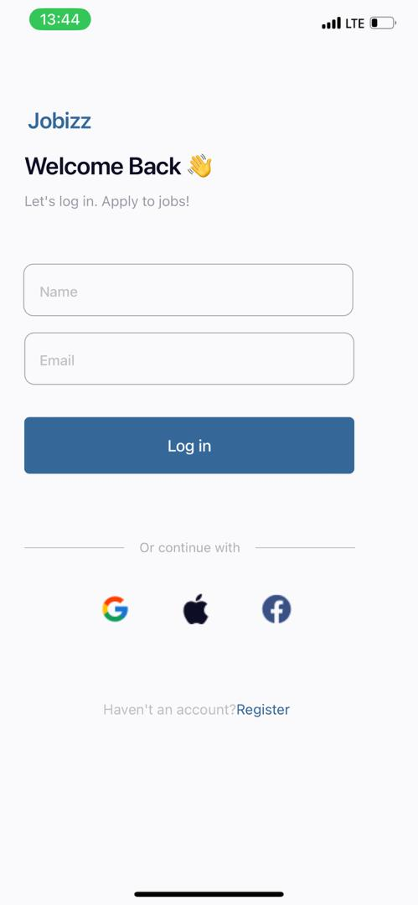

# rn-assignment4-11181591

### LoginScreen

- **Description**: Captures the user's name and email. Upon clicking the "Log in" button, it navigates to the `HomeScreen` and passes the name and email as parameters.
- **Props**: None

### HomeScreen

- **Description**: Displays the user's name and email passed from the `LoginScreen`. It also shows sections for popular and featured jobs, using the `JobCard` component to list job cards.
- **Props**: `name` (string), `email` (string) - passed via navigation params.

## Screenshot

